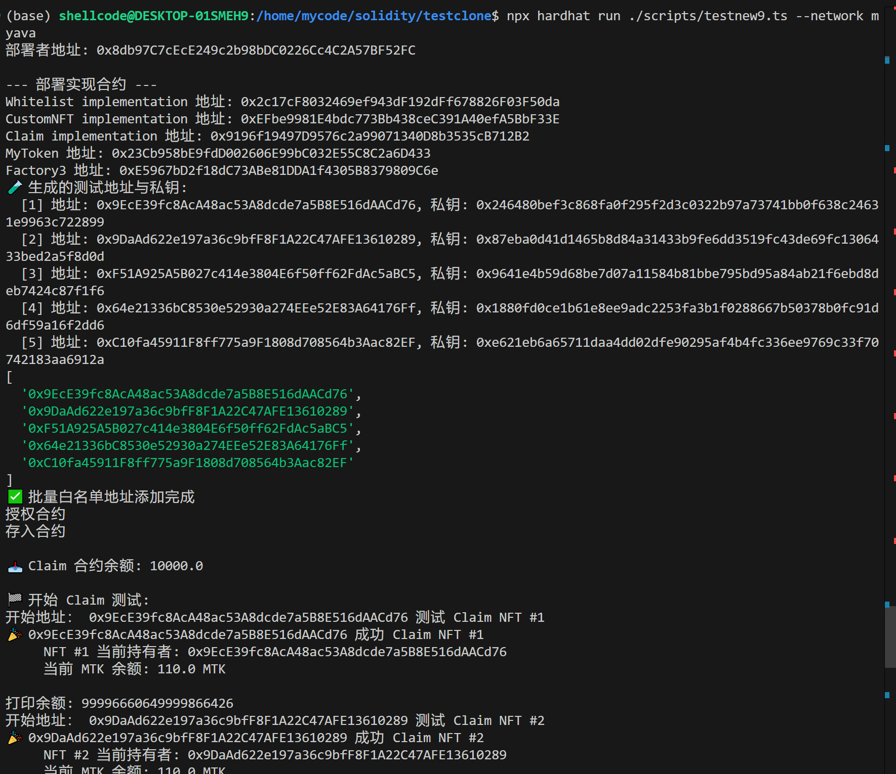

# tintinland-Academy


tintinland-Academy 是一个基于现代Web3与区块链技术的在线学习与奖励平台，旨在为web3教育培训机构提供一站式的学员注册、课程管理、学习笔记、答题考试、成绩评估以及毕业奖励领取的完整解决方案。目前已完成对**Avalanche**的L1链进行适配，并进行本地部署。

## 本地Avalanche L1的部署
* 下载安装avalanche 
```bash
 curl -sSfL https://raw.githubusercontent.com/ava-labs/avalanche-cli/main/scripts/install.sh | sh -s
```

* 添加环境变量
```bash
export PATH=~/bin:$PATH >> .bashrc
```
* 创建本地L1
```bash
 avalanche blockchain create myava
```

* 部署本地L1
```bash
avalanche blockchain deploy myava
```


## 智能合约部署
* hardhat环境下，修改一下配置：
```
import { HardhatUserConfig } from "hardhat/config";
import "@nomicfoundation/hardhat-toolbox";
import dotenv from 'dotenv';
dotenv.config();

const key = process.env.PRIVATE_KEY || "default";

const config: HardhatUserConfig = {
  solidity: {
    version: "0.8.28",
    settings: {
      optimizer: {
        enabled: true,
        runs: 200, 
      },
      metadata: {
        bytecodeHash: "none",
      },
    },
  },
  networks: {
    hardhat: {
      chainId: 31337,
    },
    localhost: {
      url: "http://127.0.0.1:8545",
      chainId: 31337,
    },
    // 根据设定chainid与RPC, 此处为新增加的合约部署配置
    myava: {
      url: "http://127.0.0.1:42829/ext/bc/Vv1L2e7PogfQ2n4wKs7dHv6f549bJQsdqNy5Fr8BVwegdu4fw/rpc",
      chainId: 888888, 
      accounts: [key]
    },
    
  },
  
};

export default config;

```
* 通过原项目hardhat部署测试脚本进行合约部署。



## Dapp项目安装与使用

```bash
# 1. 克隆仓库
git clone https://github.com/easyshellworld/tintinland-academy.git
cd tintinland-academy

# 2. 安装 Node.js（推荐 LTS）
nvm install --lts && nvm use --lts

# 3. 安装依赖
npm install

# 4. 配置环境变量
cp .env.example .env.local
# 填写：
# NEXTAUTH_SECRET=a8f9b3c1d4e762509a3718652f4d8c56
# NEXT_PUBLIC_ITEM_TITLE="tintinland-academy"  #项目标题名
# INITIAL_STUDENT_ID=1799          # 初始化学员编号
# 生成claim的工厂合约(为部署上链合约)
#NEXT_PUBLIC_CLAIM_FACTORY=0xE5967bD2f18dC73ABe81DDA1f4305B8379809C6e

# 需要在.env环境下（非.env.local环境,供应初始化数据库）
# ADMIN_ADDRESS=初始化管理员钱包地址  

# 5. 数据库初始化
npm run db:init

# 6. 启动开发服务器
npm run dev
# 打开 http://localhost:3000

# 7.项目构建与运行
npm run  build 
npm run  start

```

## DAPP交互展示
* 手动添加网络


* 利用Dapp创建新的学员claim项目


* 批量添加已筛选白名单学员钱包地址

* 向claim合约授权与转账，充入第三方ERC20合约的token

* 学员领取claim奖励


## 开发背景

随着在线教育和区块链技术的快速发展，传统学习平台往往在用户身份管理、学习数据安全、激励机制与透明度方面存在不足。OneBlock-Academy项目结合Next.js、shadcn、Tailwind CSS、SQLite以及智能合约技术，利用web3钱包身份鉴权，打破了中心化的限制，为管理员、教师与学员提供了安全、高效、模块化的学习与奖励管理系统。通过工厂模式智能合约按需求生成新claim项目智能合约（包含白名单合约，NFT合约，claim合约，支持调用第三方ERC20合约token奖励）。

## 技术栈

* **前端框架**：Next.js
* **UI 组件**：shadcn/ui + Tailwind CSS
* **数据库**：SQLite（better-sqlite3）
* **身份与访问控制**：NextAuth+viem +Wagmi（角色：管理员、老师/助教、学员）
* **区块链交互**：viem + Wagmi
* **后端**：Next.js API 路由
* **智能合约** Soildity

## 核心功能模块

1. **注册管理**：
   * 学员在线注册、信息录入与审核
   * 管理员统一审批注册数据
2. **工作人员管理**：
   * 教师/助教账户创建与权限分配
   * 管理员对工作人员进行增删改查操作
3. **公共资源管理**：
   * 文件、课程资料与学习材料的上传、分类与下载
4. **学习笔记管理**：
   * 学员可基于 Markdown 记录、编辑与查看学习笔记
   * 对学习笔记进行共享
5. **答题卡管理**：
   * 考试题库 
   * 学员在线作答与提交
6. **成绩管理**：
   * 自动批阅、人工评分与成绩统计
   * 成绩排名
7. **毕业 Claim 管理**：
   * 通过合约工厂定义毕业奖励领取流程
   * 学员完成所有模块后，调用智能合约领取链上奖励


## 项目目录结构

```
├── src/
│   ├── app/               # Next.js 路由与页面
│   ├── lib/               # 数据库交互逻辑
│   ├── components/        # 公共 UI 组件（shadcn/ui）   
│   └── app/api/         # API 路由（注册、笔记、考试、claim 等）
├── data/                  # SQLite 数据库文件
├── contracts/             # 智能合约源码以及ABI、bytecode，部署测试脚本
├── scripts/               # 初始化脚本
├── .env.example           # 环境变量模板（双模板）
├── README.md
└── package.json
```


